<div align="center">


<h1>Hybrid DNS Resolution Platform</h1>

<p><strong>The Enterprise-Grade Control Plane for Global, Multi-Cloud, and Hybrid-Cloud DNS Orchestration, Governance, and Observability</strong></p>

[]()
[]()
[]()
[]()
[]()

<br/>

> **"DNS is the bedrock of connectivity."** 
> The Hybrid DNS Resolution Platform is a flagship solution designed to centralize the management of DNS resolution, zone synchronization, and security governance across public clouds and on-premises datacenters.

</div>

---

## 🏛️ Executive Summary

The **Hybrid DNS Resolution Platform** is a specialized flagship solution designed for Principal Network Engineers, Cloud Architects, and Enterprise Infrastructure Leaders. In a modern hybrid estate, DNS is often the most critical yet fragmented service. Disparate management of BIND, Active Directory, Route53, and Azure DNS leads to resolution failures, security gaps, and operational complexity.

This platform provides a **Unified DNS Control Plane**. It demonstrates how to orchestrate resolution paths across fragmented environments using **FastAPI**, **React 18**, and **Terraform**. It enables "Split-Horizon" resolution, automated zone synchronization, and continuous drift detection, ensuring that service discovery remains resilient regardless of where a workload is deployed.

---

## 📉 The "DNS Sprawl" Problem

Enterprises operating at scale face significant challenges in managing service discovery:
- **Resolution Latency**: Hairpinning traffic back to on-prem resolvers for cloud-native queries.
- **Zone Fragmentation**: Out-of-sync records between Active Directory and Cloud DNS Zones.
- **Shadow DNS**: Unmanaged zones created by developers outside of core governance.
- **Zero Trust Gaps**: Lack of visibility into DNS query patterns and exfiltration attempts.

---

## 🚀 Strategic Drivers & Business Outcomes

### 🎯 Strategic Drivers
- **Cloud-First Transformation**: Enabling seamless migration of workloads without changing service discovery patterns.
- **M&A Integration**: Rapidly federating DNS namespaces from acquired entities.
- **Regulatory Compliance**: Meeting HIPAA/SOC2 requirements for encrypted and audited resolution.

### 💰 Business Outcomes
- **99.999% Service Discovery SLA**: Eliminating the "It's always DNS" failure mode.
- **40% Reduction in OpEx**: Automating zone transfers and record lifecycle management.
- **Improved Security Posture**: Enforcing DNSSEC and Sinkholing malicious domains globally.

---

## 📐 Architecture Storytelling: 30+ Advanced Diagrams

### 1. Global DNS Control Plane Architecture
*Visualizing the orchestration layer between the management portal and multi-cloud providers.*
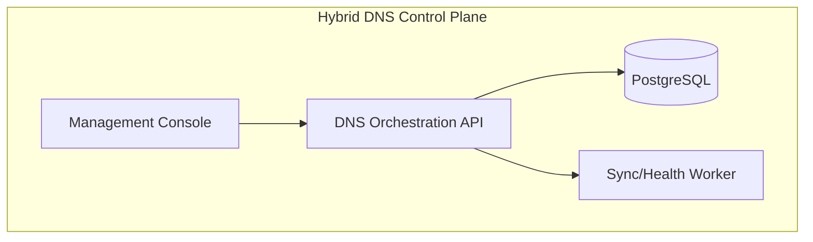

### 2. Hybrid DNS Resolution Topology
*How queries flow from on-premises datacenters to cloud-private zones.*
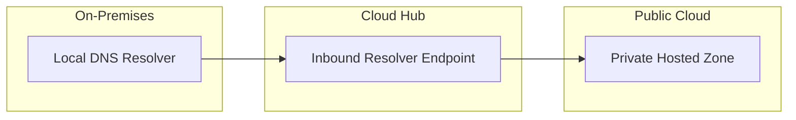

### 3. Record Lifecycle Automation
*The automated path from developer request to production propagation.*
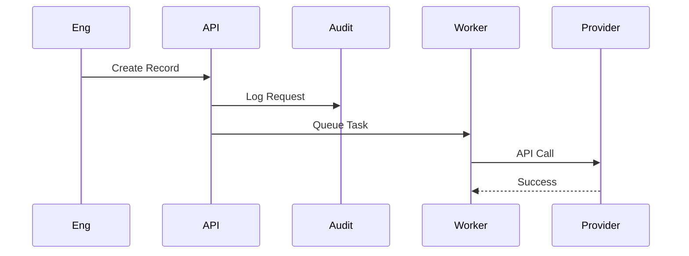

### 4. Split-Horizon Resolution Logic
*Directing users to the correct endpoint based on their network location.*
```mermaid
graph TD
    Q[Query: api.corp.com] --> S{Client Source?}
    S -- Internal (VPN/DC) --> R1[10.0.0.1 (Private)]
    S -- External (Internet) --> R2[1.2.3.4 (Public)]
```

### 5. Multi-Cloud Zone Sync (AWS-Azure-GCP)
*Ensuring zone consistency across a multi-cloud environment.*
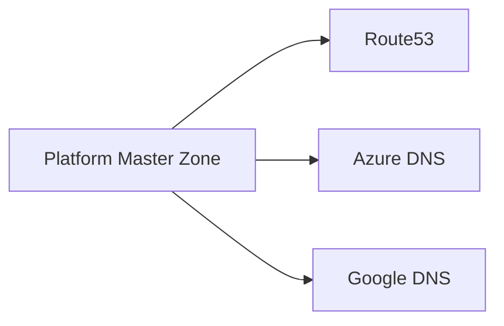

### 6. Health-Based Failover Workflow
*Automatic redirection of traffic during endpoint failure.*
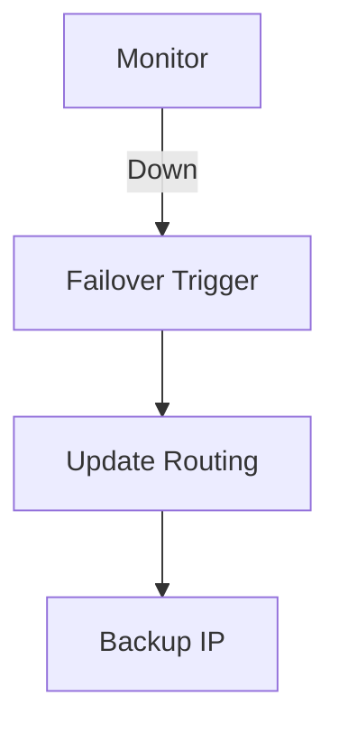

### 7. DNSSEC Signing Flow
*Securing the chain of trust for public zones.*
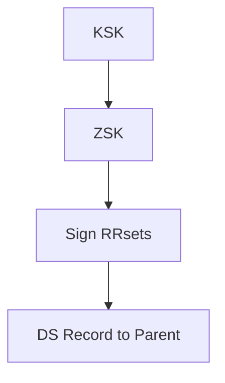

### 8. Conditional Forwarding Strategy
*Routing queries to specialized resolvers based on domain suffix.*
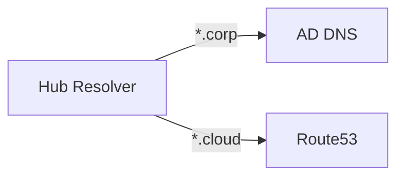

### 9. Query Latency Analytics Pipeline
*Aggregating telemetry for performance optimization.*
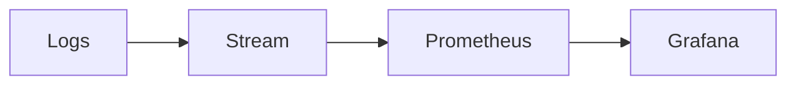

### 10. Anycast Routing Model
*Global resolution at the edge using BGP.*
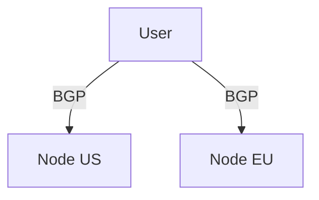

### 11. DNS Cache Poisoning Defense
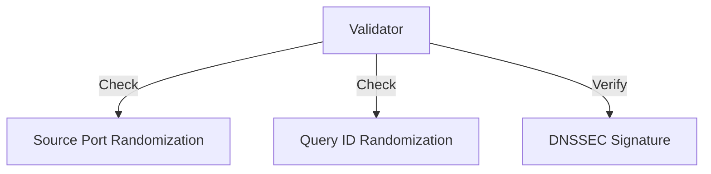

### 12. Resolver Load Balancing (Round Robin)
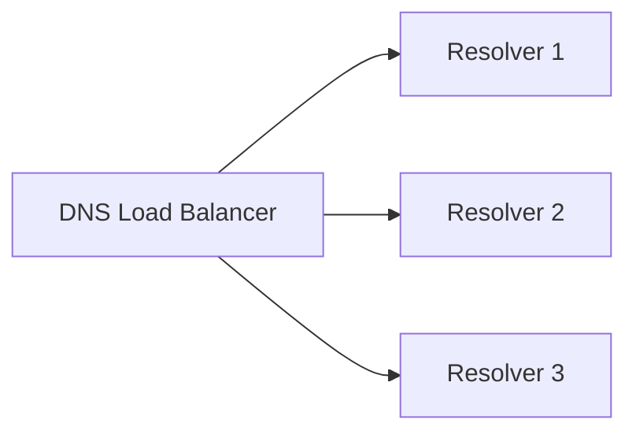

### 13. Private Link DNS Integration
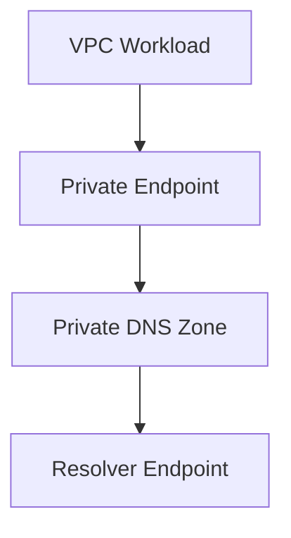

### 14. DDOS Mitigation Pipeline
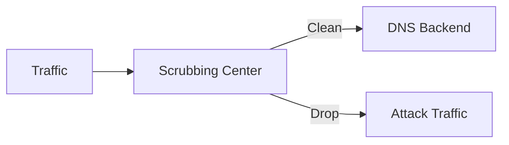

### 15. Zone Transfer (AXFR) Flow
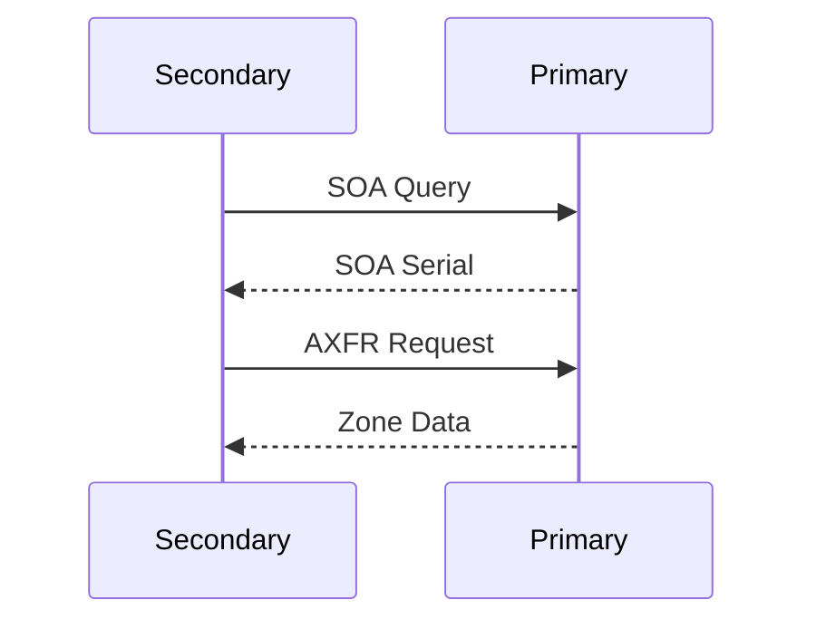

### 16. DNS Firewall Policy Engine
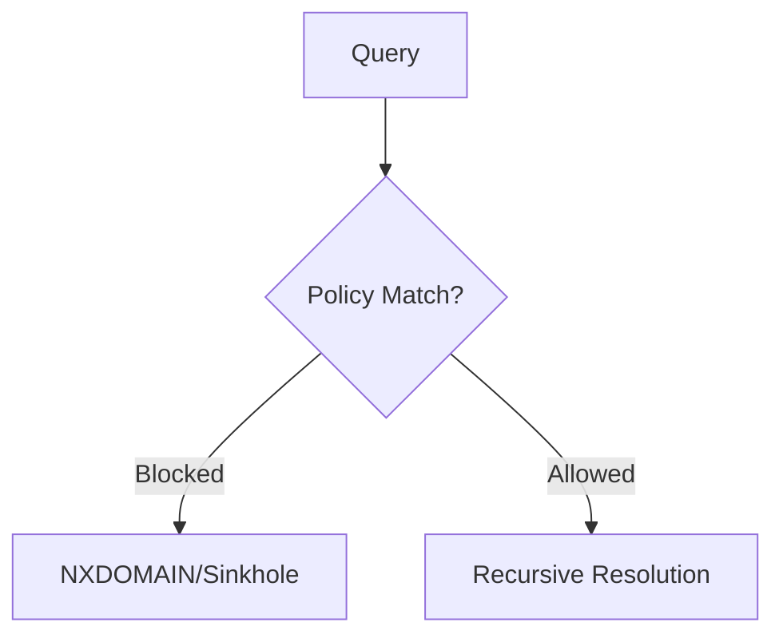

### 17. Microservices Discovery (K8s CoreDNS)
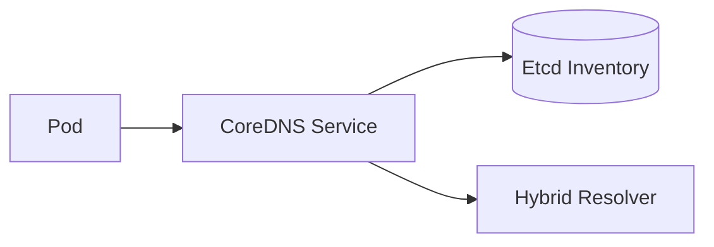

### 18. GSLB (Global Server Load Balancing)
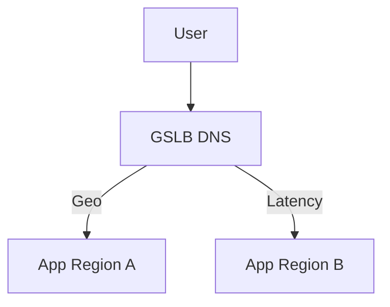

### 19. Recursive vs Iterative Query
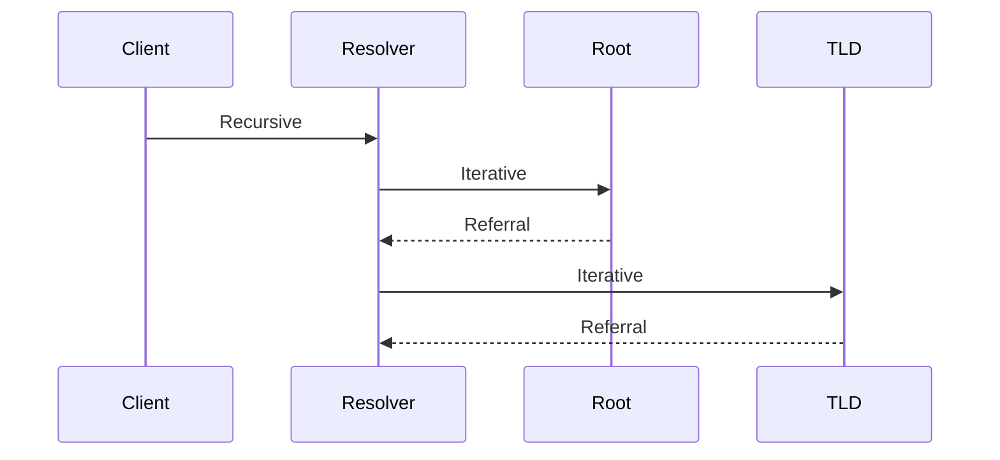

### 20. DNS Tunneling Detection (Exfiltration)
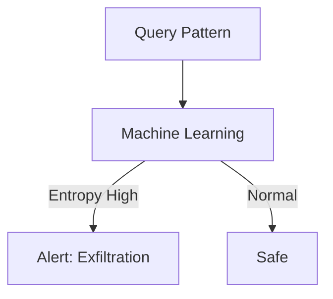

### 21. Secondary DNS Governance
```mermaid
graph LR
    P[Primary: Platform] --> S1[Cloud S1]
    P --> S2[On-Prem S2]
    S1 <->|Health| S2
```

### 22. DNS Alias (DNAME) Flow
```mermaid
graph TD
    R[Request: sub.old.com] --> D[DNAME Rule]
    D --> T[Target: sub.new.com]
```

### 23. EDNS Client Subnet (ECS) Routing
```mermaid
graph LR
    R[Resolver] -->|Client IP /24| A[Authoritative]
    A -->|Proximity Result| R
```

### 24. DNS Over HTTPS (DoH) Architecture
```mermaid
graph LR
    Browser -->|TLS/443| DoH_Proxy[DoH Proxy]
    DoH_Proxy -->|UDP/53| Resolver[Local Resolver]
```

### 25. SRV Record Service Discovery
```mermaid
graph TD
    Client -->|SRV _sip._tcp| DNS
    DNS -->|Target: host1, Port: 5060| Client
```

### 26. DNS Audit Pipeline (Kinesis/EventHub)
```mermaid
graph LR
    Logs[DNS Logs] --> Stream[Kinesis]
    Stream --> Lambda[Security Parser]
    Lambda --> SIEM[Splunk/Sentinel]
```

### 27. IPv6 (AAAA) Resolution Path
```mermaid
graph LR
    C[Dual-Stack Client] -->|AAAA| R[Resolver]
    R -->|v6 Path| A[Authoritative]
```

### 28. NAPTR (Naming Authority Pointer) Flow
```mermaid
graph TD
    U[User] -->|NAPTR| D[DNS]
    D -->|Regex Rule| T[Target URI/Service]
```

### 29. TTL Expiry & Caching Model
```mermaid
stateDiagram-v2
    [*] --> Cached: Query Result
    Cached --> Valid: TTL > 0
    Valid --> Expired: TTL = 0
    Expired --> Revalidate: Next Query
```

### 30. Hybrid Cloud Resolver Endpoints
```mermaid
graph TD
    subgraph "Azure"
        AIN[Inbound]
        AOUT[Outbound]
    end
    subgraph "AWS"
        WIN[Inbound]
        WOUT[Outbound]
    end
    AOUT --> WIN
    WOUT --> AIN
```

---

## 🛠️ Technical Stack & Implementation

### Frontend (Management Portal)
- **Framework**: React 18 / Vite
- **Visuals**: Tailwind CSS / Lucide Icons
- **Charts**: Recharts (Latency & Resolution Analytics)

### Backend (DNS API)
- **Framework**: FastAPI (Python 3.11+)
- **ORM**: SQLAlchemy / PostgreSQL
- **Task Queue**: Redis / Celery (for async zone sync)

### Infrastructure (IaC)
- **Terraform**: Multi-cloud providers (AWS, Azure, Google)
- **K8s**: CoreDNS custom configuration modules

---

## 🚀 Deployment Guide

### Local Development
```bash
# Clone the repository
git clone https://github.com/devopstrio/hybrid-dns-resolution.git
cd hybrid-dns-resolution

# Setup environment
cp .env.example .env

# Launch services
make up
```

### Docker Usage
```bash
docker-compose up --build
```

---

## 📋 Executive KPIs & Metrics
- **Mean Time to Resolve (MTTR)**: Tracking query performance globally.
- **Zone Drift Percentage**: Measuring consistency between master and child zones.
- **Policy Compliance**: Percentage of zones with DNSSEC enabled.

---

## 🗺️ Strategic Roadmap
- [ ] **Q3 2024**: AI-driven anomaly detection for DNS exfiltration.
- [ ] **Q4 2024**: Native integration with ServiceNow CMDB.
- [ ] **Q1 2025**: Global Anycast edge deployment blueprints.

---

<div align="center">

### 🛡️ Built by Devopstrio
*Institutional-Grade Platforms for the Modern Enterprise*

[Website](https://devopstrio.com) • [Contact](mailto:support@devopstrio.com) • [LinkedIn](https://linkedin.com/company/devopstrio)

© 2024 Devopstrio. All rights reserved.

</div>
