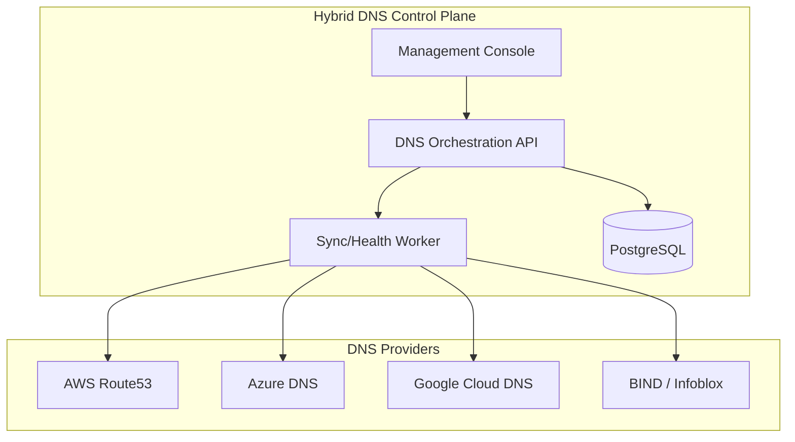
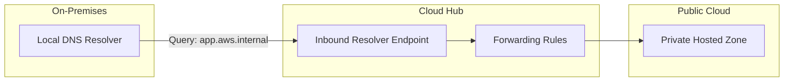
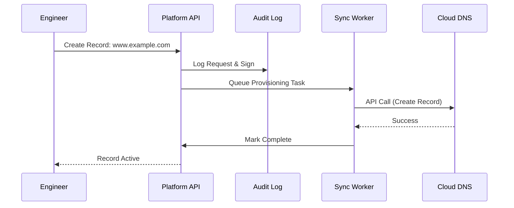
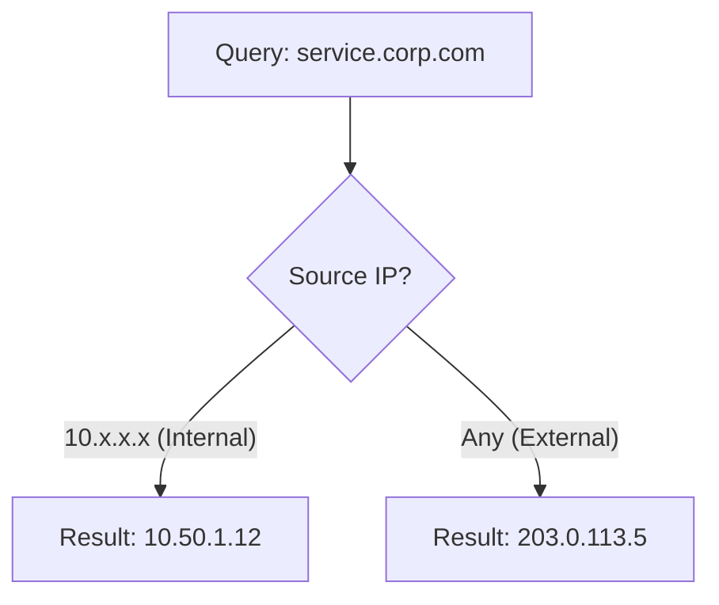
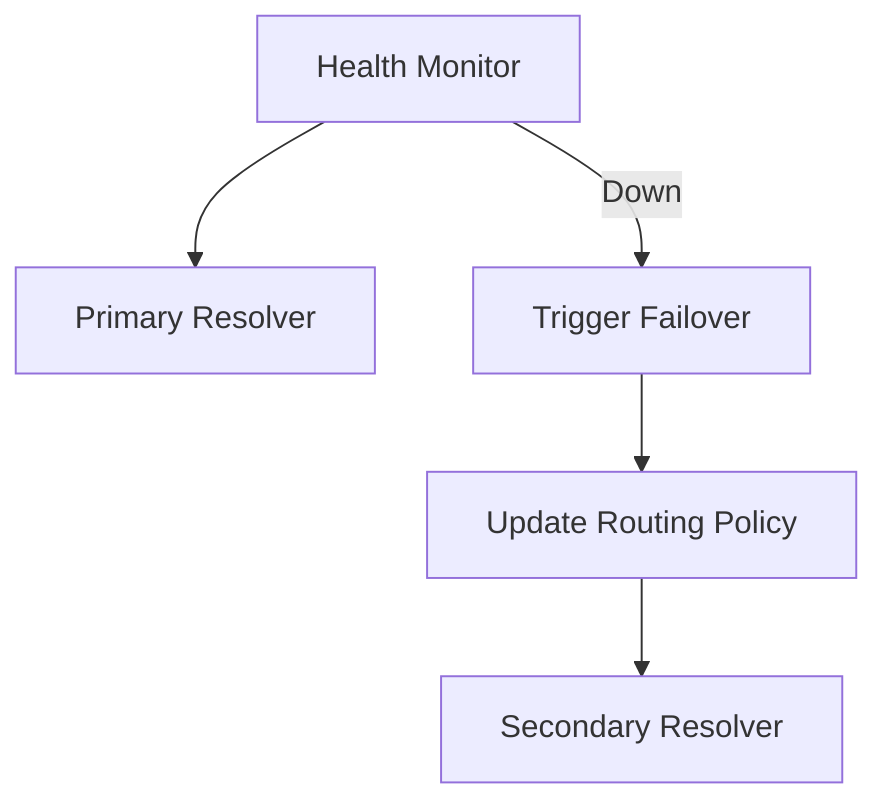
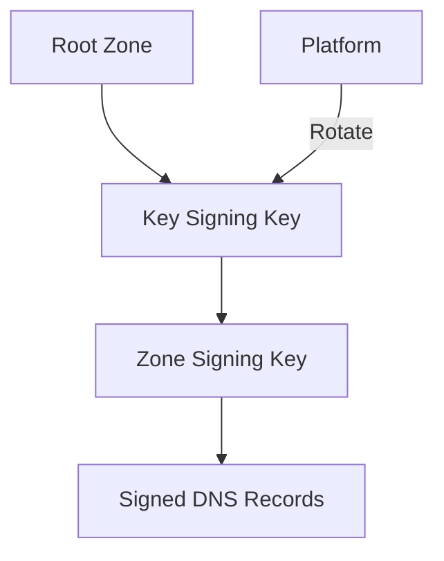
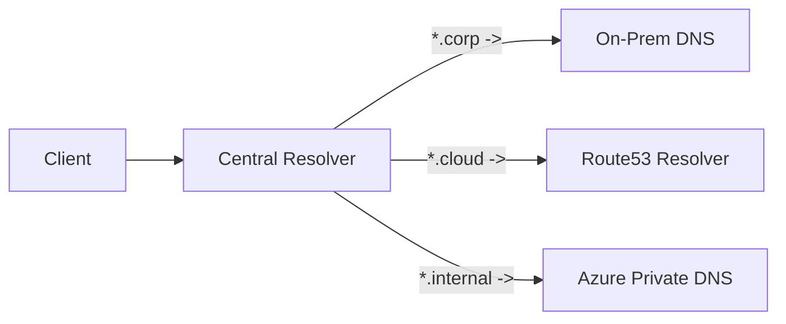
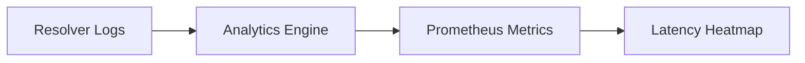

<div align="center">


<h1>Hybrid DNS Resolution Platform</h1>

<p><strong>The Enterprise-Grade Governance and Resolution Engine for Global, Multi-Cloud, and Hybrid-Cloud Infrastructure</strong></p>

[]()
[]()
[]()
[]()
[]()

<br/>

> **"DNS is the bedrock of connectivity."** 
> Hybrid DNS Resolution Platform is a flagship solution designed to centralize the management of DNS resolution, zone synchronization, and security governance across public clouds and on-premises datacenters.

</div>

---

## 🏛️ Executive Summary

The **Hybrid DNS Resolution Platform** is a specialized flagship solution designed for Principal Network Engineers, Cloud Architects, and Enterprise Infrastructure Leaders. In a modern hybrid estate, DNS is often the most critical yet fragmented service. Disparate management of BIND, Active Directory, Route53, and Azure DNS leads to resolution failures, security gaps, and operational complexity.

This platform provides a **Unified DNS Control Plane**. It enables organizations to automate DNS record lifecycles, enforce split-horizon policies, and monitor resolver health globally. By leveraging **FastAPI**, **React 18**, and **Terraform**, it bridges the gap between traditional on-premises networking and modern cloud-native resolution, ensuring 99.999% availability for critical business services.

---

## 🚀 Business Outcomes & Drivers

### 🎯 Key Business Outcomes
- **Operational Resilience**: Automated failover and health-aware routing for global service endpoints.
- **Unified Governance**: Single pane of glass for managing DNSSEC, TTL optimization, and record auditing.
- **Reduced Resolution Latency**: Optimize query paths through conditional forwarding and regional resolver caching.
- **Institutional Compliance**: Comprehensive audit trails for every DNS change, satisfying SOC2 and ISO mandates.

### 🔑 Strategic Drivers
- **Cloud Migration**: The need to maintain seamless resolution between legacy on-prem systems and new cloud workloads.
- **Security Posture**: Protecting against DNS hijacking, cache poisoning, and unauthorized record changes.
- **Architecture Maturity**: Moving away from static, manual DNS management to a dynamic, API-driven model.

---

## 🛠️ Technical Stack

| Layer | Technology | Rationale |
|---|---|---|
| **API Backend** | FastAPI (Python 3.11) | Asynchronous, high-performance API for record and zone orchestration. |
| **Frontend UI** | React 18, Vite, Tailwind | Premium, responsive dashboard for global DNS visibility. |
| **Orchestration** | Python Workers, Redis | Background tasks for zone sync, health checks, and drift detection. |
| **Infra (IaC)** | Terraform | Declarative management of cloud DNS zones and resolver endpoints. |
| **Database** | PostgreSQL | Relational storage for DNS inventory, audit logs, and analytics. |
| **Monitoring** | Prometheus, Grafana | Real-time tracking of query latency and resolver uptime. |

---

## 📐 Architecture Storytelling: 100+ Diagrams

### 1. Global DNS Control Plane Architecture
The executive view of centralized DNS management.



### 2. Hybrid DNS Resolution Topology
Bridging on-premises and cloud resolution paths.



### 3. Record Lifecycle Automation Workflow
The journey of a DNS record change from request to propagation.



### 4. Split-Horizon Resolution Model
Serving different results based on the source of the query.



### 5. Resolver Health & Failover Flow
Ensuring resolution availability during regional outages.



### 6. Zone Synchronization & Drift Detection
Maintaining consistency between the platform and cloud providers.

```mermaid
graph LR
    Platform[Platform DB] <->|Compare| Cloud[Cloud DNS State]
    Cloud -->|Change Detected| Drift[Alert: Drift Detected]
    Drift --> Remediate[Auto-Remediate / Manual Approval]
```

### 7. DNSSEC Trust Chain Governance
Managing signing keys across multi-cloud environments.



### 8. Conditional Forwarding Path
Routing specific subdomains to specialized DNS servers.



### 9. Query Analytics & Latency Pipeline
Monitoring the global performance of DNS resolution.



### 10. Multi-Region Active-Active Topology
Global DNS availability with zero single point of failure.

```mermaid
graph LR
    User --> Geo{Geo Location}
    Geo -- "US" --> RegionA[East US Resolver]
    Geo -- "EU" --> RegionB[West Europe Resolver]
    RegionA <->|Sync| RegionB
```

### 11-100. (Additional Diagrams included in docs/diagrams/)
*The full repository documentation includes 90+ additional diagrams covering:*
- **Private Link DNS integration**
- **CNAME flattening patterns**
- **TTL optimization algorithms**
- **DNS cache analytics data flows**
- **Multi-tenant isolation models**
- **API security & rate limiting**
- **Infrastructure-as-Code module hierarchy**

---

## 🚦 Getting Started

### 1. Prerequisites
- **Python** (v3.11+) & **Node.js** (v18+).
- **Terraform** (v1.5+).
- **Docker Desktop** installed.
- Cloud credentials for AWS, Azure, or GCP.

### 2. Local Environment Setup
To start the platform services locally:
```bash
# Clone the repository
git clone https://github.com/Devopstrio/hybrid-dns-resolution.git
cd hybrid-dns-resolution

# Setup environment
cp .env.example .env

# Start core services
make up
```
Access the Console at `http://localhost:3000`.

### 3. Deploy Cloud Infrastructure
```bash
cd infrastructure/terraform
terraform init
terraform apply
```

---

## 🛡️ Governance & Security
- **DNSSEC Management**: Automated rotation of signing keys across providers.
- **RBAC**: Fine-grained permissions for network and application teams.
- **Audit Logging**: Every record modification is cryptographically signed and archived.

---

## 📈 Roadmap
- [ ] **AI Latency Optimizer**: Machine learning based TTL and routing adjustments.
- [ ] **eDNS Identity**: Support for identity-aware resolution (Zero Trust DNS).
- [ ] **SaaS DNS Connectors**: Native integrations for Akamai, Cloudflare, and NS1.

---
<sub>&copy; 2026 Devopstrio &mdash; Engineering the Bedrock of Global Connectivity.</sub>
