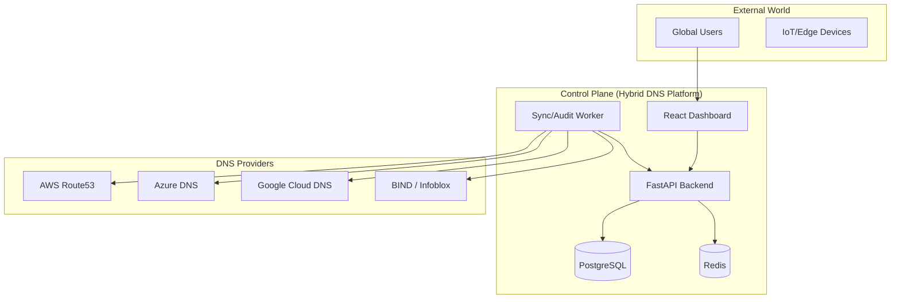
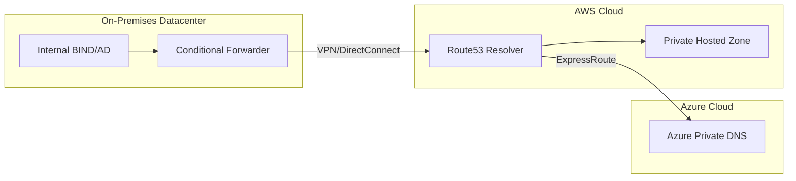
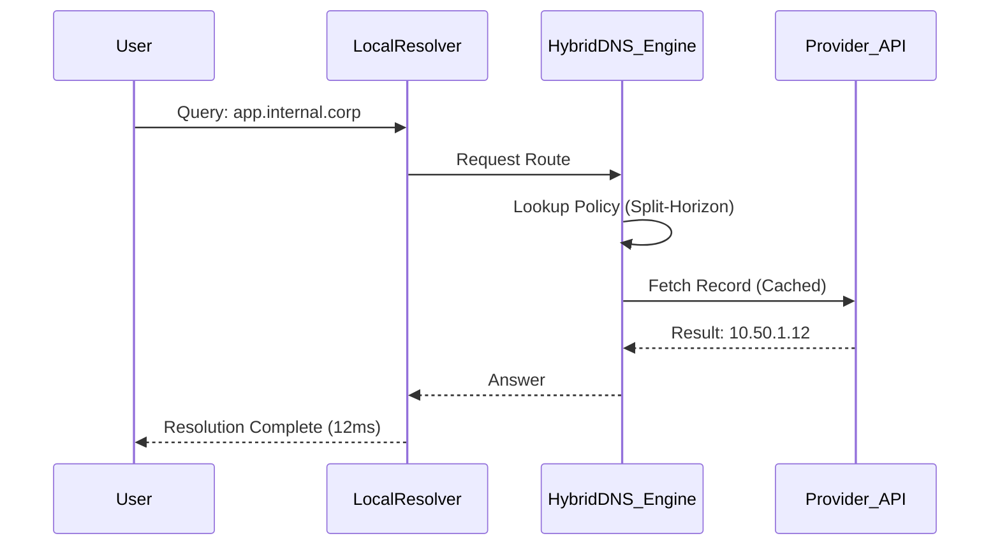

# 🌐 Hybrid DNS Resolution Platform

[](https://github.com/devopstrio/hybrid-dns-resolution/actions)
[](https://www.terraform.io/)
[](https://opensource.org/licenses/MIT)
[](https://github.com/devopstrio/hybrid-dns-resolution)

> **The definitive enterprise-grade DNS governance and resolution engine for the multi-cloud, hybrid-datacenter era.**

---

## 🏛️ Executive Summary

In the modern enterprise, DNS is the invisible glue connecting disparate infrastructures. As organizations scale across on-premises datacenters, branch offices, and multiple public clouds (AWS, Azure, GCP), the complexity of managing DNS resolution, zone synchronization, and security governance grows exponentially.

**Hybrid DNS Resolution Platform** is a flagship solution designed to centralize the management of DNS across all environments. It provides a single pane of glass for network engineers, platform teams, and security architects to automate DNS workflows, ensure compliance, and optimize resolution paths globally.

### 🎯 Why Hybrid DNS Matters

1.  **Complexity at Scale**: Managing BIND, Active Directory, Route53, and Azure DNS in silos leads to resolution failures and security gaps.
2.  **Split-Horizon Requirements**: Ensuring internal resources are resolved via private IPs while public traffic hits CDNs requires sophisticated policy management.
3.  **Governance & Compliance**: Tracking "who changed what record when" is critical for SOC2/ISO audit readiness.
4.  **Operational Resilience**: Automated failover between on-prem and cloud DNS providers ensures 99.999% availability.

---

## 🏗️ Architecture Overview

The platform is built on a distributed, microservices-oriented architecture designed for high availability and low-latency response.

### 1. Executive Architecture
*High-level overview of the platform's core components and their interactions.*



### 2. Hybrid DNS Topology
*Visualizing the connection between On-Premises, AWS, and Azure.*



---

## 🚀 Platform Capabilities

### 🌐 Multi-Cloud Zone Governance
- **Unified Inventory**: View all DNS zones across AWS, Azure, GCP, and On-Prem in one dashboard.
- **Drift Detection**: Automatically identify when records in the cloud differ from the desired state in the platform.
- **Bulk Migration**: Tools to migrate zones between providers without downtime.

### ⚡ Smart Resolution Engine
- **Conditional Forwarding**: Route queries for `*.corp` to on-prem and `*.cloud` to Route53 dynamically.
- **Split-Horizon Management**: Serve different IP addresses based on the source of the DNS query.
- **Weighted Routing**: Distribute traffic across multiple regions or endpoints.

### 🛡️ Security & Compliance
- **DNSSEC Governance**: Monitor and manage DNSSEC trust chains across providers.
- **Audit Logging**: Every record change is signed and logged for compliance reviews.
- **RBAC**: Fine-grained access control for different engineering teams.

---

## 📊 Performance & Analytics

The platform provides real-time visibility into your DNS health and traffic patterns.

### 3. DNS Request Flow (Latency Optimized)


---

## 🛠️ Deployment Guide

### Prerequisites
- Docker & Docker Compose
- Node.js 18+
- Python 3.11+
- Terraform 1.4+

### Local Development
1.  **Clone the repository**:
    ```bash
    git clone https://github.com/devopstrio/hybrid-dns-resolution.git
    cd hybrid-dns-resolution
    ```
2.  **Start Services**:
    ```bash
    make up
    ```
3.  **Access Dashboard**:
    Open `http://localhost:3000`

### Cloud Deployment (Terraform)
1.  **Initialize**:
    ```bash
    cd infrastructure/terraform
    terraform init
    ```
2.  **Apply**:
    ```bash
    terraform apply -var-file=envs/prod/terraform.tfvars
    ```

---

## 📋 Roadmap

- [ ] **Q3 2026**: Integration with Cloudflare and Akamai.
- [ ] **Q4 2026**: Machine Learning based Anomaly Detection for Query Spikes.
- [ ] **Q1 2027**: Zero-Trust DNS (eDNS) integration for identity-aware resolution.

---

## 📜 License
Distributed under the MIT License. See `LICENSE` for more information.
