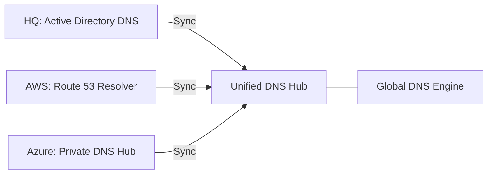
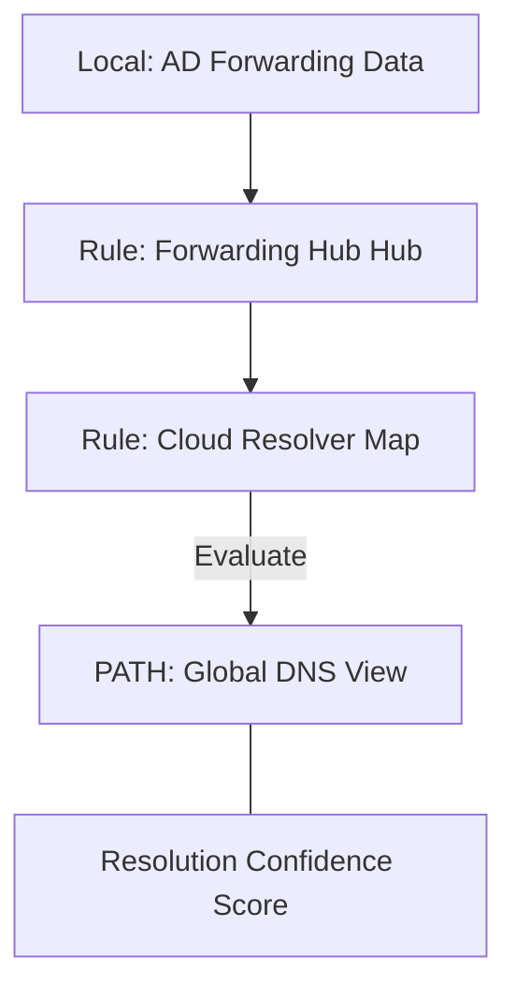
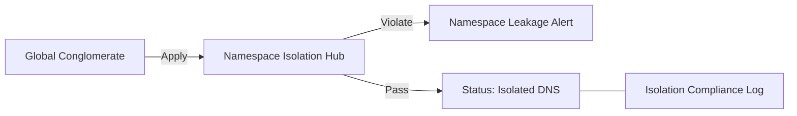
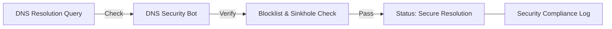
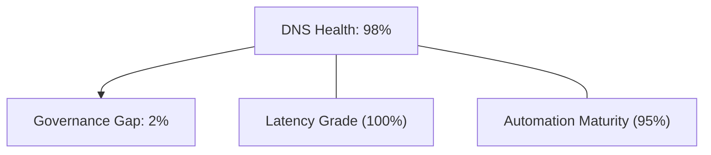
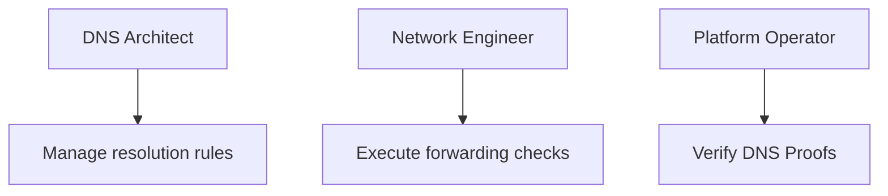
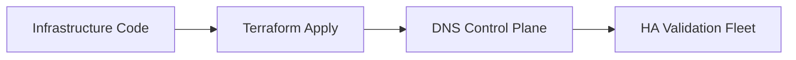
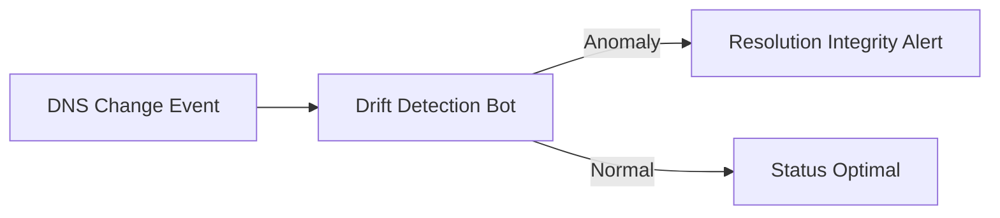
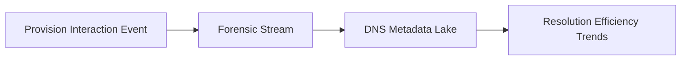

<div align="center">


<h1>Hybrid DNS Resolution</h1>

<p><strong>The Institutional-Grade Platform for Multi-Cloud DNS Orchestration, Hybrid Conditional Forwarding, and Secure Service Discovery.</strong></p>

[]()
[]()
[]()

<br/>

> **"DNS is the bedrock of connectivity."** 
> **Hybrid DNS Resolution** is an enterprise-grade platform designed to provide a secure, measurable, and highly automated foundation for global DNS operations. It orchestrates the complex lifecycle of name resolution—from multi-cloud conditional forwarding and split-horizon synchronization to distributed DNSSEC governance and unified resolution auditing.

</div>

---

## 🏛️ Executive Summary

Fragmented DNS silos and manual forwarding configurations are strategic operational liabilities; lack of centralized DNS orchestration is a primary barrier to organizational hybrid-cloud maturity. Organizations fail to maintain a secure DNS foundation not because of a lack of zones, but because of fragmented resolution standards, lack of automated traffic validation, and an inability to orchestrate DNS landing zones with operational precision.

This platform provides the **DNS Intelligence Plane**. It implements a complete **Enterprise DNS-Resolution-as-Code Framework**, enabling Network and Platform teams to manage global DNS resolution as first-class citizens. By automating the identification of resolution bottlenecks through real-time telemetry analysis and orchestrating the deployment of secure cross-cloud forwarding hubs, we ensure that every organizational service—from core datacenter IPs to distributed cloud resources—is discoverable by default, audited for history, and strictly aligned with institutional DNS frameworks.

---

## 📐 Architecture Storytelling: Principal Reference Models

### 1. Principal Architecture: Global Hybrid DNS Resolution & Intelligence Plane
This diagram illustrates the end-to-end flow from multi-cloud DNS ingestion and forwarding orchestration to split-horizon sync, security enforcement, and institutional DNS auditing.

```mermaid
graph LR
    %% Subgraph Definitions
    subgraph DNS_Ingress["Hybrid & Multi-Cloud Ingress"]
        direction TB
        OnPrem_AD_DNS["Local Active Directory DNS"]
        Cloud_DNS_Zones["Route 53 / Azure DNS / Cloud DNS"]
        Workload_Queries["Client Resolution Requests"]
    end

    subgraph IntelligenceEngine["DNS Intelligence Hub"]
        direction TB
        API["FastAPI DNS Gateway"]
        ForwardingOrch["Cross-Cloud Forwarding Orch"]
        SplitHorizon_Hub["Split-Horizon & Sync Hub"]
        SecurityHub["DNSSEC & RPZ Security Hub"]
    end

    subgraph OperationsPlane["Distributed DNS Fleet"]
        direction TB
        InboundEndpoints["Inbound / Outbound Resolver Endpoints"]
        ForwardingAgents["Managed Conditional Forwarders"]
        SecurityProxies["DNS Security & Sinkhole Proxies"]
    end

    subgraph OperationsHub["Institutional DNS Hub"]
        direction TB
        Scorecard["DNS Maturity Scorecard"]
        Analytics["Resolution Latency & NX Stats"]
        Audit["Forensic DNS Metadata Lake"]
    end

    subgraph DevOps["DNS-Resolution-as-Code Framework"]
        direction TB
        TF["Terraform DNS Modules"]
        DriftBot["Forwarding & Record Drift Validator"]
        ChatOps["DNS Operations Hub"]
    end

    %% Flow Arrows
    DNS_Ingress -->|1. Submit DNS Request| API
    API -->|2. Orchestrate Forwarding| ForwardingOrch
    ForwardingOrch -->|3. Apply Split-Horizon| SplitHorizon_Hub
    SplitHorizon_Hub -->|4. Assess Security| SecurityHub
    
    SecurityHub -->|5. Execute Provision| OperationsPlane
    OperationsPlane -->|6. Notify Status| ChatOps
    API -->|7. Visualize Health| Scorecard
    
    Scorecard -->|8. Track Maturity| Analytics
    Scorecard -->|9. Record Provision| Audit
    
    TF -->|10. Provision Backbone| IntelligenceEngine
    DriftBot -->|11. Inject Config Risk| ForwardingOrch
    Audit -->|12. Improve Resolution| InboundEndpoints

    %% Styling
    classDef ingress fill:#f5f5f5,stroke:#616161,stroke-width:2px;
    classDef intel fill:#e8eaf6,stroke:#1a237e,stroke-width:2px;
    classDef operations fill:#e1f5fe,stroke:#01579b,stroke-width:2px;
    classDef ops fill:#ede7f6,stroke:#311b92,stroke-width:2px;
    classDef devops fill:#e8f5e9,stroke:#1b5e20,stroke-width:2px;

    class DNS_Ingress ingress;
    class IntelligenceEngine intel;
    class OperationsPlane operations;
    class OperationsHub ops;
    class DevOps devops;
```



### 2. The Hybrid DNS Lifecycle Flow
The continuous path of a hybrid DNS resolution from initial request (query) and forwarding (logic) to active authoritative resolution, cache (performance), and institutional forensic auditing.


### 3. Distributed Hybrid DNS Topology
Strategically orchestrating DNS resolution across global environments (Active Directory, Route 53, Azure Private DNS, GCP Cloud DNS), providing a unified institutional view of global DNS health and LZ readiness.



### 4. Cross-Cloud Conditional Forwarding & Hub Flow
Executing complex logic for securing the bridge between on-premises DNS servers and Cloud DNS inbound/outbound endpoints, ensuring every organizational service is discoverable and verified against institutional standards.



### 5. Multi-Tenant DNS Isolation & Governance Flow
Automatically managing DNS namespace isolation and cross-tenant resolution for global conglomerates, ensuring institutional data residency and security boundaries by default.



### 6. DNS Security & Threat Intelligence Flow
Managing the lifecycle of a DNS query, automatically enforcing institutional blocklists, RPZ (Response Policy Zones), and DNSSEC verification, ensuring zero-latency security confidence.



### 7. Institutional DNS Maturity Scorecard
Grading organizational performance based on key indicators: Latency/Redundancy Grade, Security Coverage (DNSSEC), and Automation Maturity Index.



### 8. Identity & RBAC for DNS Governance
Managing fine-grained access to landing zone hubs, forwarding workers, and audit logs between DNS Architects, Network Engineers, and Cloud Platform Operators.



### 9. IaC Deployment: DNS-Resolution-as-Code Framework
Using modular Terraform to deploy and manage the versioned distribution of the DNS tracking hubs, forwarding workers, and forensic metadata lakes.



### 10. AIOps DNS Drift & Performance Validation Flow
Using advanced analytics to identify sudden surges in NXDOMAIN responses, latency, suspicious configuration drifts, or unusual resolution pattern changes that could result in institutional risk.



### 11. Metadata Lake for Forensic DNS Audit
Storing long-term records of every DNS query (logs), every record change recorded, and every forwarding rule event for institutional record-keeping, compliance auditing, and post-provisioning forensics.



---

## 🏛️ Core Governance Pillars

1.  **Unified Foundation Coordination**: Maximizing resilience by centralizing all DNS measurement through a single institutional plane.
2.  **Automated Forwarding Provisioning**: Eliminating "manual rule" scenarios through proactive orchestration and pattern verification.
3.  **Sequential Resolution Intelligence**: Ensuring zero-interruption operations through dependency-aware multi-cloud traffic engineering.
4.  **Zero-Trust DNS Protection**: Automatically enforcing identity-based access and rule evaluation across all DNS tiers.
5.  **Autonomous Operations Logic**: Guaranteeing reliability through automated industry-specific DNS monitoring runbooks.
6.  **Full DNS Auditability**: Immutable recording of every record change and forwarding rule for institutional forensics.

---

## 🛠️ Technical Stack & Implementation

### DNS Engine & APIs
*   **Framework**: Python 3.11+ / FastAPI.
*   **Forwarding Engine**: Custom Python-based logic for multi-cloud resolver provisioning and DORA-style DNS metrics.
*   **Integrations**: Native connectors for AWS Route 53, Azure Private DNS, GCP Cloud DNS, and Infoblox/BIND APIs.
*   **Persistence**: PostgreSQL (DNS Ledger) and Redis (Live DNS State).
*   **Auth Orchestrator**: Federated OIDC/SAML for least-privilege DNS management access.

### Governance Dashboard (UI)
*   **Framework**: React 18 / Vite.
*   **Theme**: Dark, Blue, Slate (Modern high-fidelity DNS aesthetic).
*   **Visualization**: D3.js for DNS topologies and Recharts for resolution velocity analytics.

### Infrastructure & DevOps
*   **Runtime**: AWS EKS or Azure Kubernetes Service (AKS) for management plane.
*   **DNS Hub**: Managed event sourcing for immutable DNS security timeline reconstruction.
*   **IaC**: Modular Terraform for deploying the DNS landing zone and validation fleet.

---

## 🏗️ IaC Mapping (Module Structure)

| Module | Purpose | Real Services |
| :--- | :--- | :--- |
| **`infrastructure/dns_hub`** | Central management plane | EKS, PostgreSQL, Redis |
| **`infrastructure/resolvers`** | Distributed resolver provisioners | K8s Workers, Cloud APIs |
| **`infrastructure/forwarders`** | Hybrid Forwarding Hubs | Webhooks, Lambda |
| **`infrastructure/auditing`** | Forensic DNS sinks | S3, Athena, Quicksight |

---

## 🚀 Deployment Guide

### Local Principal Environment
```bash
# Clone the landing zone platform
git clone https://github.com/devopstrio/hybrid-dns-resolution.git
cd hybrid-dns-resolution

# Configure environment
cp .env.example .env

# Launch the Hybrid DNS stack
make init

# Trigger a mock forwarding provision and automated resolution validation simulation
make simulate-dns
```

Access the Management Portal at `http://localhost:3000`.

---

## 📜 License
Distributed under the MIT License. See `LICENSE` for more information.

---
<div align="center">
  <p>© 2026 Devopstrio. All rights reserved.</p>
</div>
