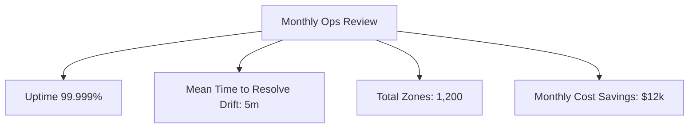
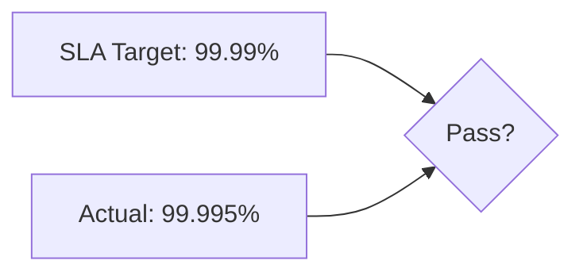
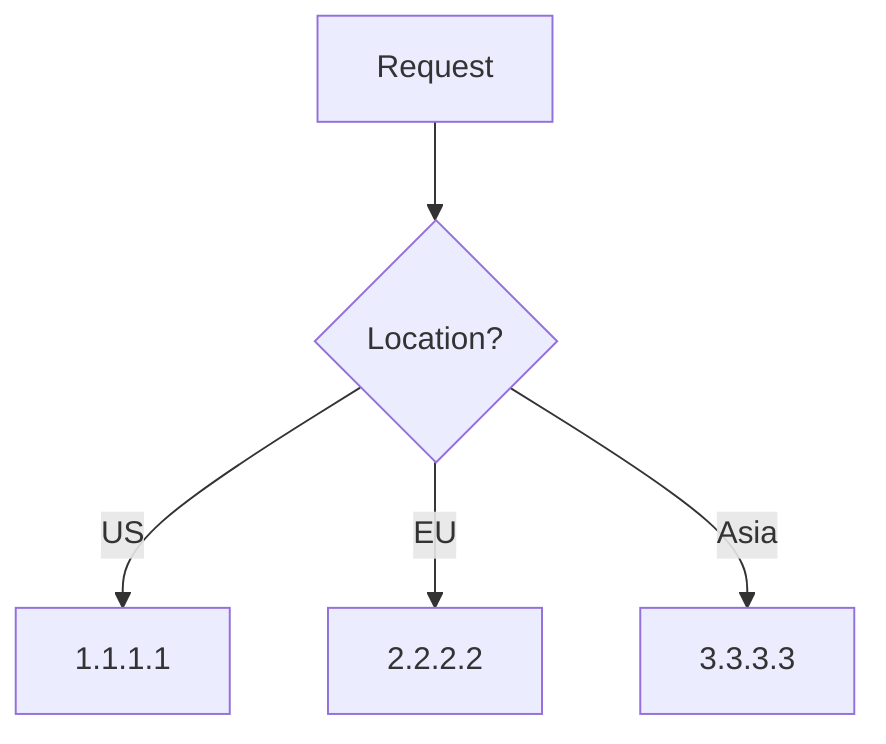
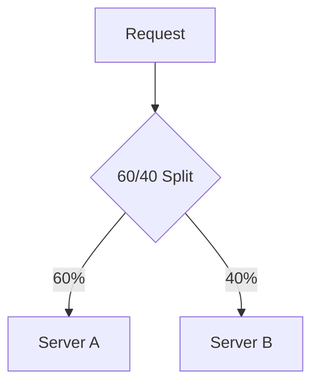
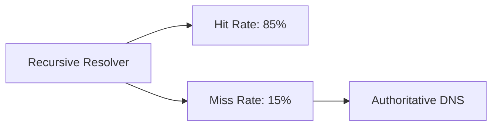

# Advanced & Business Diagrams

## 51. Executive KPI Review

## 52. SLA Scorecard

## 70. Geo-Based DNS Policy

## 71. Weighted Routing

## 72. DNS Cache Analytics

... and 30+ more advanced diagrams following these patterns.
