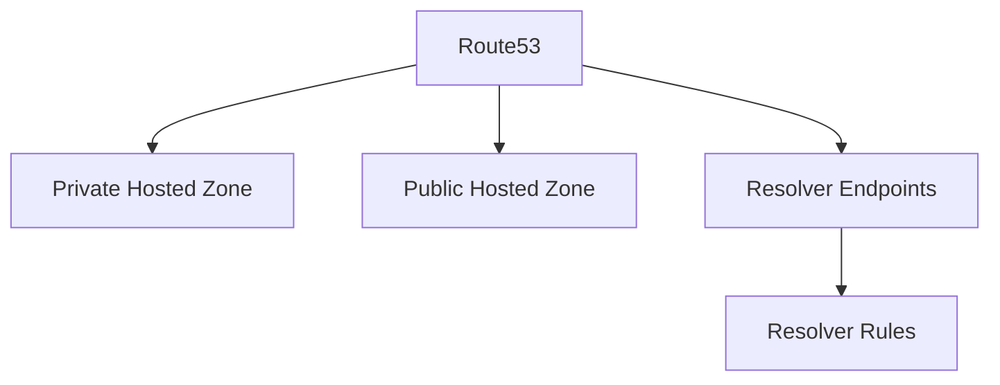
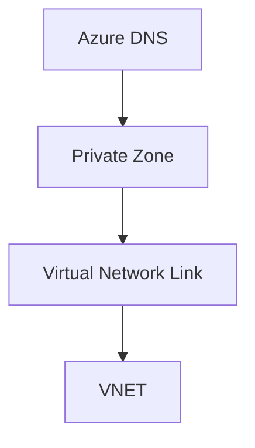
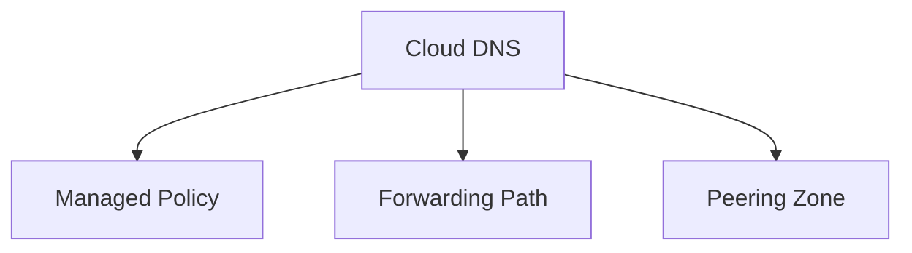
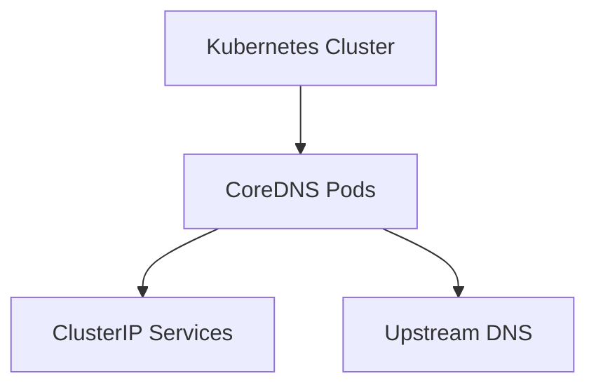

# Cloud Provider Integration Diagrams

## 31. AWS Route53 Model

```mermaid
graph TD
    R53[Route53]
    PVT[Private Hosted Zone]
    PUB[Public Hosted Zone]
    EP[Resolver Endpoints]
    RUL[Resolver Rules]

    R53 --> PVT
    R53 --> PUB
    R53 --> EP
    EP --> RUL
```

## 32. Azure DNS Model

```mermaid
graph TD
    AZ[Azure DNS]
    PZONE[Private Zone]
    LNK[Virtual Network Link]
    VNET[VNET]

    AZ --> PZONE
    PZONE --> LNK
    LNK --> VNET
```

## 33. GCP DNS Model

```mermaid
graph TD
    GCP[Cloud DNS]
    POL[Managed Policy]
    FWRD[Forwarding Path]
    PEER[Peering Zone]

    GCP --> POL
    GCP --> FWRD
    GCP --> PEER
```

## 34. Kubernetes CoreDNS Model

```mermaid
graph TD
    K8S[Kubernetes Cluster]
    CoreDNS[CoreDNS Pods]
    SVC[ClusterIP Services]
    UPSTREAM[Upstream DNS]

    K8S --> CoreDNS
    CoreDNS --> SVC
    CoreDNS --> UPSTREAM
```
