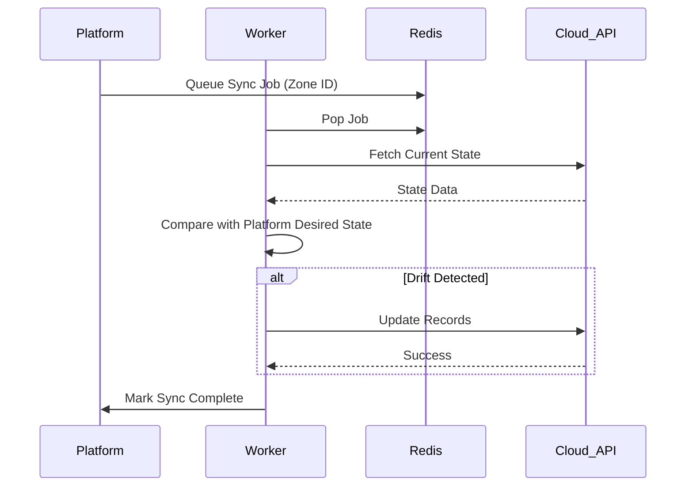
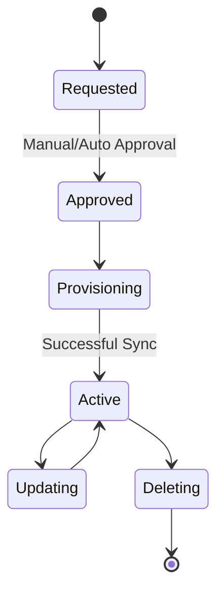
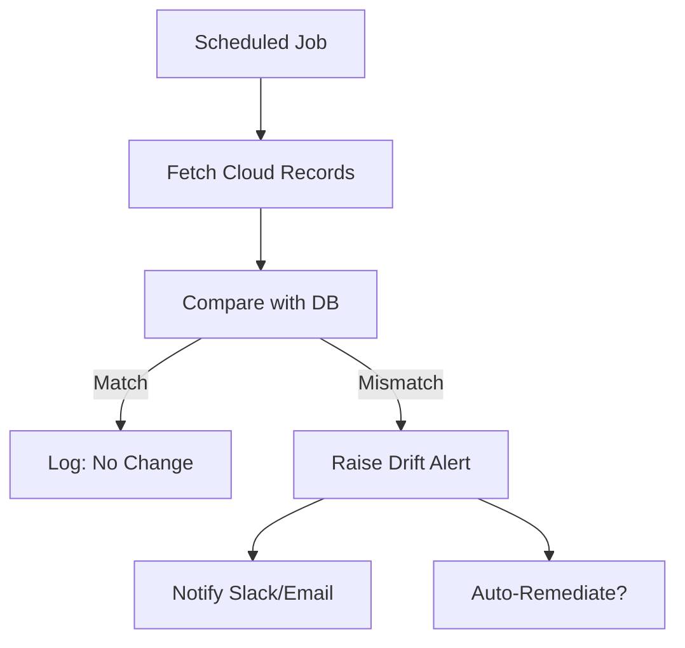
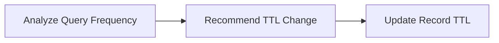
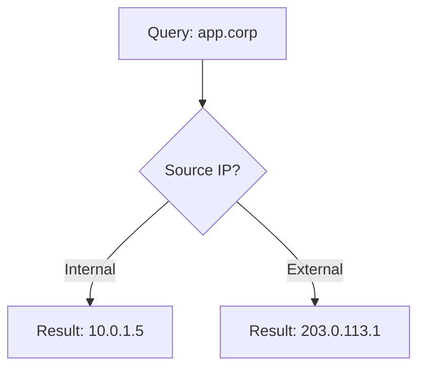

# DNS Operations Diagrams

## 21. Zone Sync Flow
*The process of synchronizing zones between the platform and cloud providers.*

## 22. Record Lifecycle
*The lifecycle of a DNS record from creation to deletion.*

## 23. Drift Detection Flow
*Continuous monitoring of DNS consistency.*

## 24. TTL Optimization Flow

## 25. Split Horizon Model

