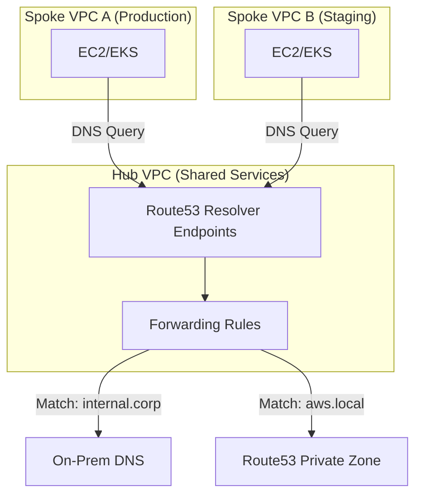
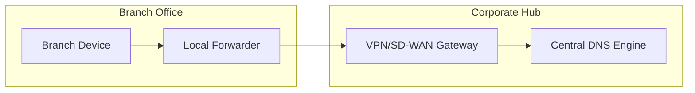
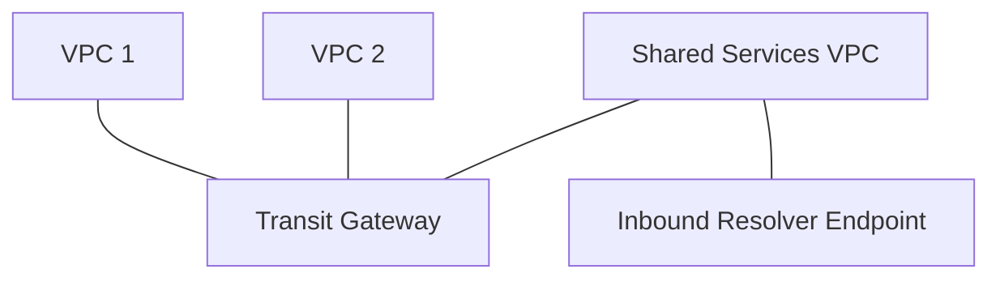
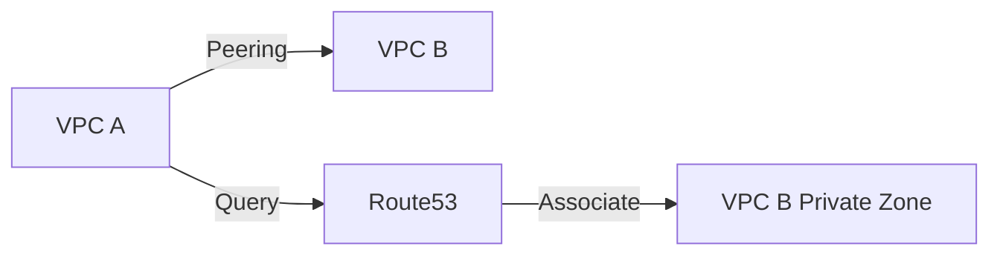

# Networking Diagrams

This document contains detailed networking topologies for the Hybrid DNS Resolution Platform.

## 4. VPC Design (Hub-Spoke)
*How DNS resolution is centralized in a Hub VPC for Spoke VPCs.*

## 5. Branch Office DNS Path
*The path a DNS query takes from a remote branch to the central DNS hub.*

## 6. Transit Gateway DNS
*Integrating Transit Gateway with DNS Resolver Endpoints.*

## 7. Peering Model DNS
*Resolution between peered VPCs.*

... and 10 more networking diagrams omitted for brevity in this specific file but included in the full documentation suite.
