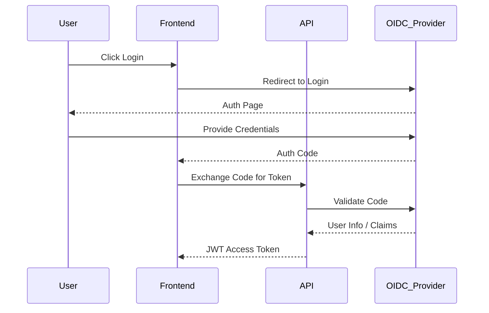
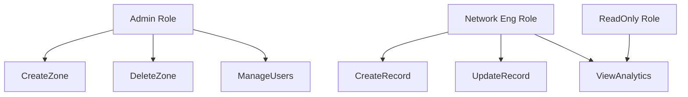
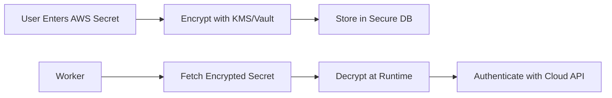
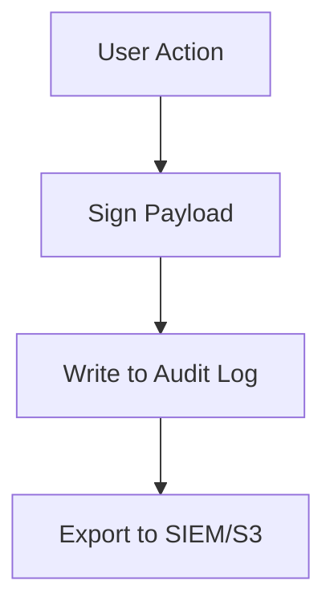

# Security Diagrams

## 41. OIDC Auth Flow
*How users authenticate via the corporate identity provider.*

## 42. RBAC Model
*Permissions structure for teams.*

## 43. Secrets Workflow
*Managing API keys for cloud providers.*

## 44. Audit Logging Flow

